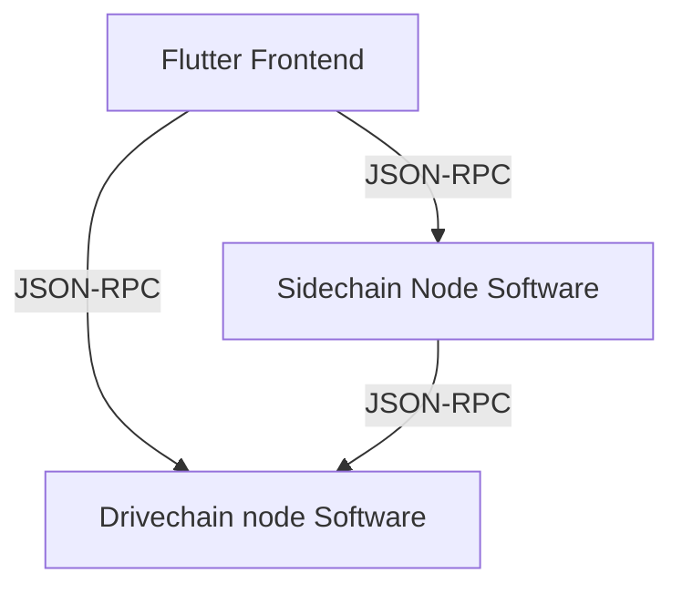

# BitNames

A collection of frontends for different Drivechain-based sidechains.

1. [Testchain](https://github.com/layerTwo-Labs/testchain)  
   A template sidechain that can be used as the starting point for creating
   Drivechain sidechains
2. [ZSide](https://github.com/LayerTwo-Labs/thunder-orchard)  
   A sidechain based off of ZSide

The frontends come in different flavors for the different sidechains:

1. TestSail
2. EthSail
3. ZSail

Building these frontends involve several steps that "flavorize" the base
application into the end result, as well as download node binaries for the
sidechain in question. This is all wrapped up in a script:

```bash
$ ./scripts/build-app.sh {macos,linux,windows} {zside,testchain}
# result is in ./release
```

The build requirements are a bit convoluted, and differ based on the flavor and
platform you're building for. The best way to understand the details is probably
to consult the [CI build configuration](../../.github/workflows/dart.yml).

The architecture of the frontends all follow the same structure:



The Drivechain node software is the same for all the flavors:
[`mainchain`](https://github.com/LayerTwo-Labs/mainchain).

The sidechain node software varies based on the flavor, see the links at the
start of this README.

For ease of use, the released build artifacts bundle these node binaries
together with the frontend application. The node binaries are started on launch
of the frontend, if needed.
