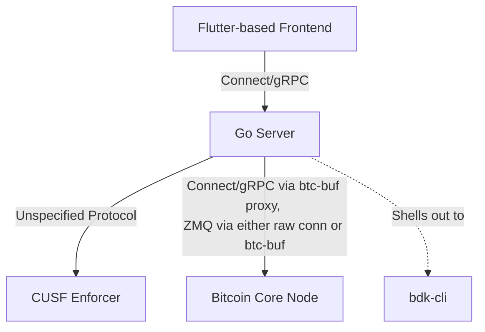
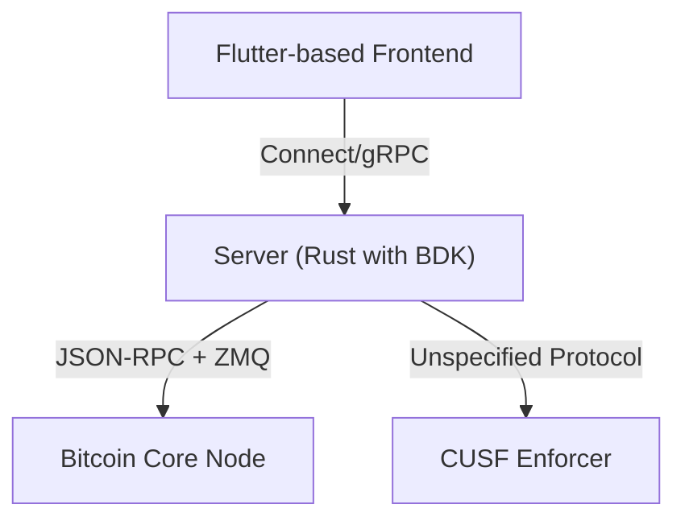

# Architecture



- All wallet functionality is handled by `btc-cli`
- Bitcoin Core is strictly used for reading chain data. Wallet is entirely
  untouched

Pros:

- Devs are way more proficient in Go than Rust
- Availability of [Connect](https://github.com/connectrpc/connect-go/) for Go.
  Makes it _really_ simple to spin up a server that supports both gRPC and REST.
- Availability of strongly typed Bitcoin Core RPC-system through
  [`btc-buf`](https://github.com/barebitcoin/btc-buf)

Cons:

- Shelling out to BDK sounds brittle. Does it contain all the functionality we
  need? On the other hand, perhaps this is a nice barrier of sorts. BDK is a big
  beast...
- Have to pass in the raw descriptor (which contains the xpriv) for each
  command. Is this OK?

PoC: have been able to generate an address, receive funds to it, sync and print
the updated balance. This was on testnet, with a public Electrum node hosted by
Blockstream at `electrum.blockstream.info:60002`. Code for this is in
`server/main.go`.

Further validations that need to happen before we're confident that this works:

1. ~~Verify we're able to send. This shouldn't be too hard, just haven't gotten
   around to it.~~
1. Verify we're able to connect to our own signet network (this needs to be
   created!). Will `bdk-cli` crash if the signet network has other parameters?
1. ~~Verify we're able to modify `btc-buf` to run in-memory. Should be easy
   enough. If not, we'll just use `rpcclient` from `btcd`.~~

# Dependencies:

1. `bdk-cli`.
   ```bash
   # note: key-value-db is required for Windows
   $ cargo install --git https://github.com/bitcoindevkit/bdk-cli --no-default-features --features=key-value-db,compiler,electrum
   ```

# Other alternatives considered

## Writing this in Rust

Pros:

- Raw access to BDK

Cons:

- Rust is really complex



## Go-based BDK FFI

There's no official FFI bindings for Go. Can use
[3rd party Go bindings](https://github.com/NordSecurity/uniffi-bindgen-go) for
Uniffi (which is what powers the BDK FFI). Haven't looked into this. Might not
be needed at all.
