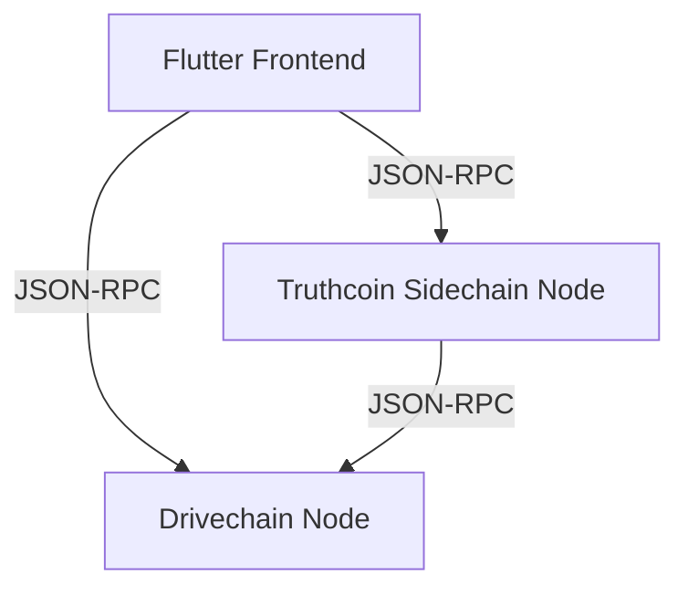

# Truthcoin

A prediction market sidechain frontend for Drivechain.

## Building

```bash
$ ./scripts/build-app.sh {macos,linux,windows}
# result is in ./release
```

The build requirements differ based on the platform you're building for. The best way to understand the details is to consult the [CI build configuration](../../.github/workflows/dart.yml).

## Architecture



The Drivechain node software is [`mainchain`](https://github.com/LayerTwo-Labs/mainchain).

For ease of use, the released build artifacts bundle node binaries together with the frontend application. The node binaries are started on launch of the frontend, if needed.
